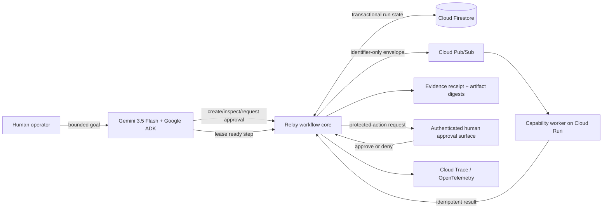

# Nymrel Relay — All Things Agentic competition slice

Nymrel Relay is a guarded long-running agent fleet for work that must survive retries, duplicate delivery, process crashes, and human approval boundaries.

This directory is the net-new competition implementation created during the Google All Things Agentic submission period. It is isolated from the pre-existing Swarm Studio dashboard so the pre-existing versus new-work boundary remains auditable.

## What exists

- a provider-neutral durable workflow core;
- dependency and cycle validation;
- capability-scoped work leases;
- bounded retries and stale-lease recovery;
- idempotent result recording;
- exact human approval requests for protected steps;
- canonical SHA-256 evidence receipts;
- optimistic state revisions;
- Firestore transactional persistence;
- Pub/Sub work dispatch that excludes goals, prompts, secrets, and approval notes;
- a Gemini 3.5 Flash Google ADK operator;
- deterministic offline tests.

The agent can create a plan, inspect its state, request human approval, dispatch approved work, and recover expired leases. It **cannot approve its own requests**, merge code, deploy, spend, accept legal terms, or claim an external effect occurred merely because it was queued.

## Architecture



## State contract

Run and step states are explicit:

- run: `queued`, `running`, `awaiting_approval`, `completed`, `failed`, `inconclusive`;
- step: `pending`, `leased`, `awaiting_approval`, `completed`, `failed`, `blocked`;
- evidence result: `pass`, `fail`, `blocked`, `inconclusive`, `error`.

Missing evidence is never silently converted into success.

## Local core validation

The core tests use only the Python standard library:

```bash
cd competition/all-things-agentic
PYTHONPATH=. python -m unittest discover -s tests -v
python -m compileall -q relay_core relay_google relay_agent tests
```

The Google adapter tests inject a fake Pub/Sub publisher. They do not require an account or credential.

## Google ADK setup

Use an isolated environment and the current project metadata:

```bash
cd competition/all-things-agentic
python -m venv .venv
source .venv/bin/activate  # Windows: .venv\Scripts\activate
python -m pip install --upgrade pip
python -m pip install -e .
```

For local development with the in-memory domain store:

```bash
export RELAY_STORE=memory
export RELAY_MODEL=gemini-3.5-flash
agents-cli playground
```

For an approved Google Cloud development environment:

```bash
export GOOGLE_CLOUD_PROJECT=YOUR_PROJECT_ID
export GOOGLE_CLOUD_LOCATION=us-central1
export RELAY_STORE=firestore
export RELAY_FIRESTORE_COLLECTION=nymrel_relay_runs
export RELAY_PUBSUB_TOPIC=relay-work
export RELAY_MODEL=gemini-3.5-flash
agents-cli deploy
```

Provisioning, authentication, billing, IAM, API enablement, deployment, and teardown are external actions. Do not commit service-account keys or API keys. Use Application Default Credentials and a project-scoped service account with the minimum Firestore, Pub/Sub, Cloud Run, logging, and tracing permissions required by the approved deployment.

## Tool boundary

The ADK operator exposes tools to:

- create a bounded plan from an explicit JSON step list;
- inspect run state;
- prepare a human approval request;
- dispatch an approved ready step through Pub/Sub;
- recover expired leases.

There is intentionally no `approve`, `merge`, `deploy`, `pay`, `publish`, or arbitrary shell tool. Human decisions must enter through a separate authenticated surface.

## Demo scenario

1. Create a five-step public/synthetic open-source review plan.
2. Run two validation steps in parallel.
3. Deliver one Pub/Sub message twice; show one receipt.
4. Let one worker lease expire; recover and resume it.
5. Reach a protected Cloud Run deployment step.
6. Show the ADK agent prepare, but not resolve, the approval.
7. Approve through the operator surface.
8. Dispatch and complete the isolated deployment check.
9. Show run state, receipts, revisions, trace identifiers, and the exact remaining limitation.

## Evidence claims

A Relay receipt establishes only that the named Relay version recorded the supplied expected and observed statements, artifact digests, and result for that run and step. It does not establish:

- the identity of a model, worker, company, or person;
- that an external deployment or account action actually occurred unless independently verified;
- security certification;
- production admission;
- legal or regulatory compliance.

## Remaining competition work

The studio still needs to:

- register and verify official competition eligibility/rules;
- create or select a Google Cloud project within the approved budget;
- provision Firestore, Pub/Sub, Cloud Run, IAM, and tracing;
- implement a capability worker callback and authenticated human approval UI;
- connect the existing Swarm Studio dashboard to the Relay state API;
- run failure, duplicate-delivery, recovery, and protected-action demonstrations in Google Cloud;
- capture architecture, deployment proof, approximately four-minute demo, repository access, and submission receipts.

All public fixtures must be synthetic or public-safe. No private customer, family, health, financial-account, credential, or private Studio Agent OS data belongs in the competition environment.
